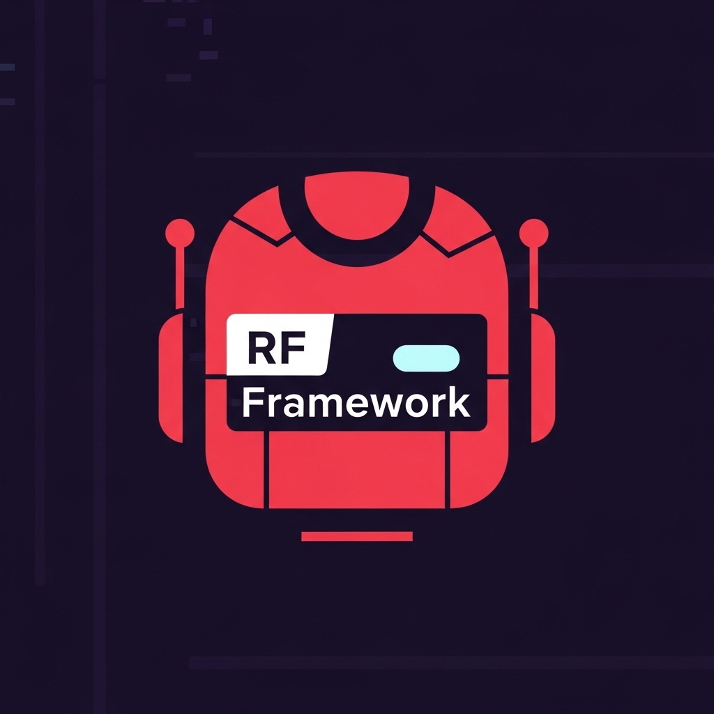

# Robot Framework Keywords Explorer

<p align="center">
  
</p>

[](https://marketplace.visualstudio.com/items?itemName=Haitham-Al-Mughrabi.robot-framework-keywords)
[](https://marketplace.visualstudio.com/items?itemName=Haitham-Al-Mughrabi.robot-framework-keywords)
[](https://marketplace.visualstudio.com/items?itemName=Haitham-Al-Mughrabi.robot-framework-keywords)

A comprehensive VS Code extension that supercharges your Robot Framework development with intelligent keyword and variables management, documentation viewing, and project scanning capabilities.

## 🚀 Features

### 📁 **Project Keywords Explorer**
- **Automatic Scanning**: Automatically discovers and indexes all keywords from your project files
- **Smart Organization**: Organizes keywords by library and source file
- **Real-time Updates**: Refreshes keyword list when files change
- **Import Integration**: One-click import of libraries and resources

### 🔧 **Official Keywords Library**
- **Built-in Keywords**: Access to Robot Framework standard library keywords
- **Browser Library**: Comprehensive Browser library keyword support
- **SeleniumLibrary**: Full SeleniumLibrary keyword collection

### 📋 **Variables Management**
- **Variable Discovery**: Automatically finds variables from Python and Robot files
- **Smart Insertion**: Insert variables with proper `${variable}` syntax
- **Type Detection**: Identifies variable types (string, list, dict, etc.)
- **File Import**: Import variable files with one click

### 📖 **Interactive Documentation**
- **Keyword Documentation**: View detailed documentation for any keyword
- **Argument Information**: See parameter types, defaults, and descriptions
- **Source Links**: Navigate to keyword source files
- **Copy Documentation**: Export documentation to clipboard

### ⚡ **Productivity Features**
- **One-Click Insert**: Insert keywords with proper Robot Framework syntax
- **Smart Templates**: Keywords include parameter placeholders with default values
- **Copy to Clipboard**: Copy keyword calls for use anywhere
- **Custom Keywords**: Add and manage your own keyword definitions
- **Configurable Defaults**: Set default values for common parameters

## 📸 Screenshots

### Project Keywords Explorer


### Documentation Viewer


### Variables Management


## 🛠 Installation

1. Open VS Code
2. Go to Extensions (Ctrl+Shift+X)
3. Search for "Robot Framework Keywords Explorer"
4. Click Install

Or install from the command line:
```bash
code --install-extension Haitham-Al-Mughrabi.robot-framework-keywords
```

## 🎯 Quick Start

1. **Open a Robot Framework project** in VS Code
2. **Look for the Robot Framework panel** in the Explorer sidebar
3. **Browse keywords** in the Project Keywords, Official Keywords, or Variables sections
4. **Click any keyword** to insert it at your cursor position
5. **Right-click keywords** for additional options like documentation and copying

## 📚 Usage Guide

### Inserting Keywords

**Method 1: Direct Click**
- Click any keyword in the tree view to insert it at the cursor position

**Method 2: Context Menu**
- Right-click a keyword and select "Insert Keyword"
- Use "Copy Keyword" to copy without inserting

### Viewing Documentation

1. Right-click any keyword
2. Select "Show Documentation"
3. View detailed information in the Documentation panel

### Managing Variables

1. Browse variables in the Variables section
2. Click to insert with proper `${variable}` syntax
3. Use "Import Variables File" to add variable file imports

### Importing Libraries

1. Right-click any library in Project Keywords
2. Select "Import Library/Resource"
3. The import statement is automatically added to your Settings section

### Customizing Defaults

1. Use the settings gear icon in any keyword view
2. Configure default values for common parameters
3. Add custom keywords for your project

## ⚙️ Configuration

### Extension Settings

| Setting | Description | Default |
|---------|-------------|---------|
| `robotFrameworkKeywords.scanCustomKeywords` | Automatically scan workspace for keywords | `true` |
| `robotFrameworkKeywords.scanVariables` | Automatically scan workspace for variables | `true` |
| `robotFrameworkKeywords.wrapVariables` | Wrap variables with ${} when inserting | `true` |
| `robotFrameworkKeywords.showIcons` | Show icons in tree views | `true` |
| `robotFrameworkKeywords.projectScanPaths` | Glob patterns for scanning project files | See below |

### Default Scan Paths
```json
[
  "Libraries/**/*.py",
  "POM/**/*.{robot,resource}",
  "Utilities/**/*.{py,robot,resource}",
  "Resources/**/*.{py,robot,resource}",
  "*.resource"
]
```

### Custom Default Values
Configure default values for keyword parameters:
```json
{
  "robotFrameworkKeywords.defaultValues": {
    "url": "https://your-app.com",
    "browser": "chrome",
    "timeout": "30s",
    "selector": "css=.my-selector"
  }
}
```

## 🔧 Supported File Types

- **Robot Framework**: `.robot`, `.resource`
- **Python Libraries**: `.py` files with Robot Framework keywords
- **Variable Files**: Python and Robot Framework variable files

## 🎨 Customization

### Project Structure Support
The extension automatically adapts to common Robot Framework project structures:
- Page Object Model (POM)
- Library-based organization
- Resource file hierarchies
- Mixed Python/Robot projects

### Keyword Recognition
Supports various keyword definition formats:
- Robot Framework `*** Keywords ***` sections
- Python classes with Robot Framework decorators
- Custom library implementations

## 🐛 Troubleshooting

### Keywords Not Appearing?
1. Check that your files match the scan patterns in settings
2. Use the refresh button in the Project Keywords panel
3. Verify your keyword definitions follow Robot Framework syntax

### Variables Not Found?
1. Ensure variable files are in supported formats
2. Check the Variables panel refresh button
3. Verify variable definitions use proper Robot Framework syntax

### Import Statements Not Working?
1. Make sure you're in a `.robot` file
2. Check that the Settings section exists in your file
3. Verify the file paths are correct relative to your workspace

## 🤝 Contributing

We welcome contributions! Please see our [Contributing Guide](CONTRIBUTING.md) for details.

### Development Setup
1. Clone the repository
2. Run `npm install`
3. Open in VS Code
4. Press F5 to launch Extension Development Host

## 📄 License

This extension is licensed under the [MIT License](LICENSE).

## 🔗 Links

- [GitHub Repository](https://github.com/haitham-al-mughrabi/rf-browser-keywords)
- [Issue Tracker](https://github.com/haitham-al-mughrabi/rf-browser-keywords/issues)
- [VS Code Marketplace](https://marketplace.visualstudio.com/items?itemName=Haitham-Al-Mughrabi.robot-framework-keywords)

## 📈 Changelog

See [CHANGELOG.md](CHANGELOG.md) for a detailed list of changes.

---

**Enjoy using Robot Framework Keywords Explorer!** 🤖✨