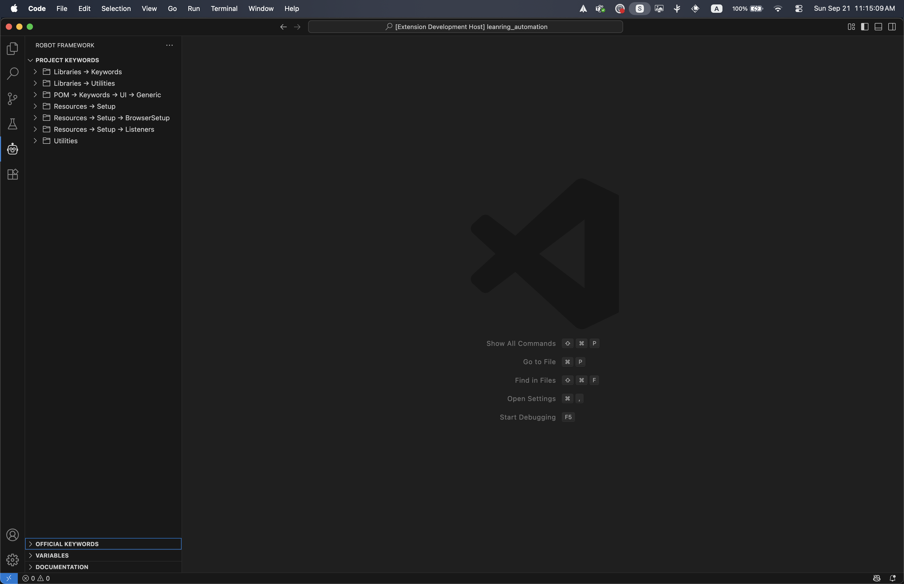
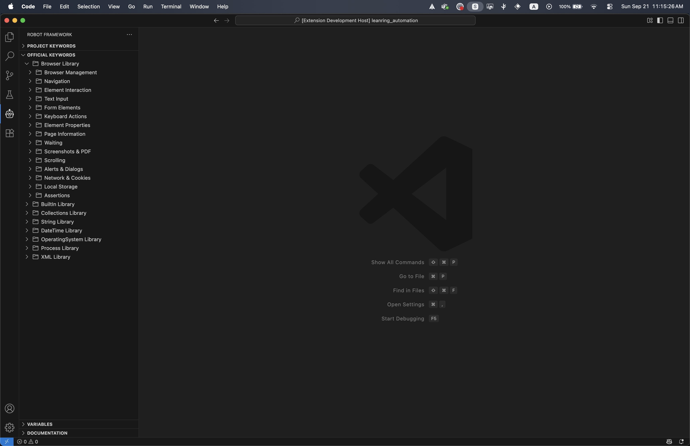
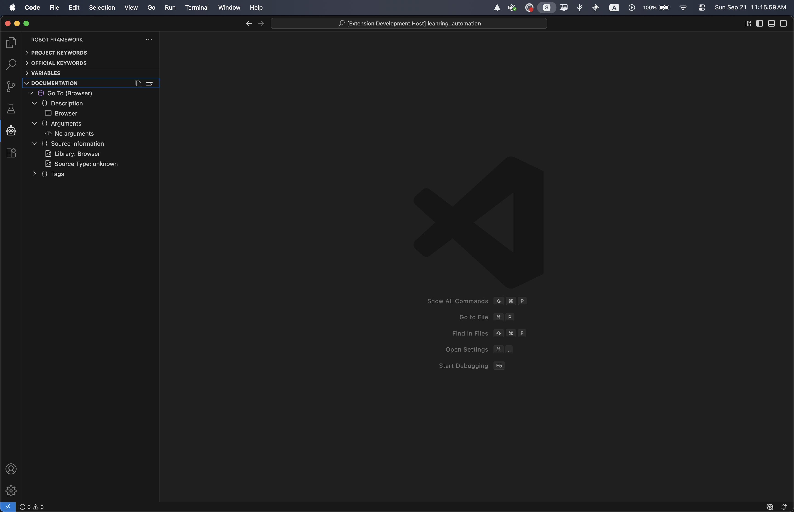
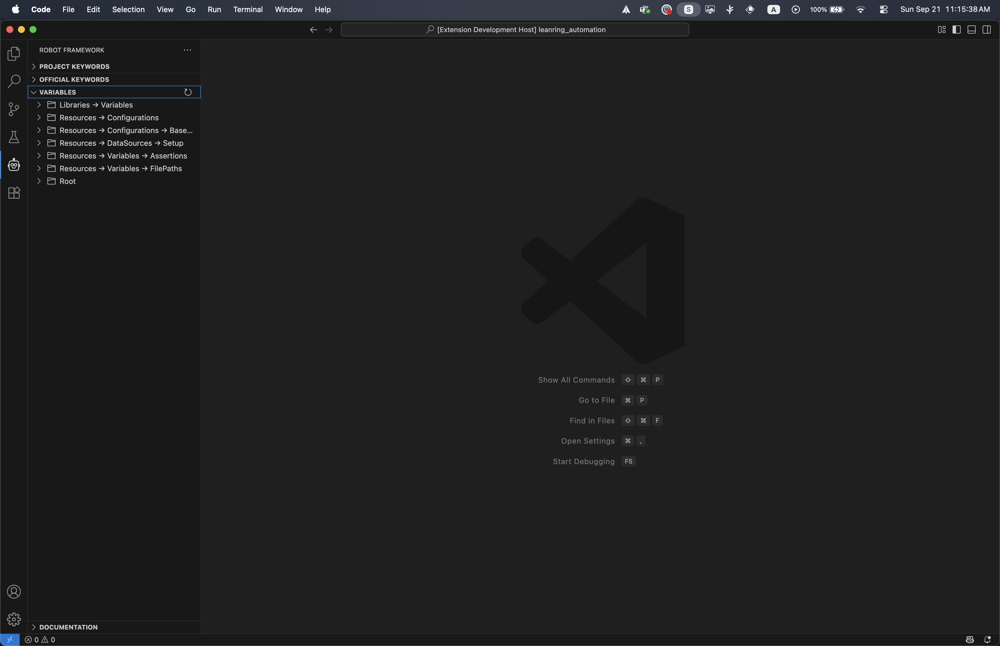

# Robot Framework Keywords Explorer

<p align="center">
  
</p>

[](https://marketplace.visualstudio.com/items?itemName=Haitham-Al-Mughrabi.robot-framework-keywords)
[](https://marketplace.visualstudio.com/items?itemName=Haitham-Al-Mughrabi.robot-framework-keywords)
[](https://marketplace.visualstudio.com/items?itemName=Haitham-Al-Mughrabi.robot-framework-keywords)

A comprehensive VS Code extension that supercharges your Robot Framework development with intelligent keyword and variables management, documentation viewing, and project scanning capabilities.

## 🚀 Features

### 📁 **Project Keywords Explorer**
- **Automatic Scanning**: Automatically discovers and indexes all keywords from your project files
- **Smart Organization**: Organizes keywords by library and source file
- **Real-time Updates**: Refreshes keyword list when files change
- **Import Integration**: One-click import of libraries and resources

### 🔧 **Official Keywords Library**
- **BuiltIn Library**: 80+ Robot Framework standard library keywords (logging, variables, control flow, data conversion)
- **Browser Library**: Modern web testing with Playwright-based browser automation
- **SeleniumLibrary**: 150+ comprehensive SeleniumLibrary keywords (browser management, element interaction, waits)
- **Collections Library**: List and dictionary manipulation keywords
- **String Library**: Text processing and manipulation keywords
- **DateTime Library**: Date and time handling keywords
- **OperatingSystem Library**: File system and OS interaction keywords
- **Process Library**: Process execution and management keywords
- **XML Library**: XML document processing keywords
- **RequestsLibrary**: HTTP API testing keywords

### 📋 **Variables Management**
- **Variable Discovery**: Automatically finds variables from Python and Robot files
- **Smart Insertion**: Insert variables with proper `${variable}` syntax
- **Type Detection**: Identifies variable types (string, list, dict, etc.)
- **File Import**: Import variable files with one click

### 📖 **Interactive Documentation**
- **Keyword Documentation**: View detailed documentation for any keyword
- **Argument Information**: See parameter types, defaults, and descriptions
- **Source Links**: Navigate to keyword source files
- **Copy Documentation**: Export documentation to clipboard

### ⚡ **Productivity Features**
- **One-Click Insert**: Insert keywords with proper Robot Framework syntax
- **Interactive Parameter Input**: Dialog box for modifying default parameter values before insertion
- **Smart Templates**: Keywords include parameter placeholders with intelligent defaults
- **Copy to Clipboard**: Copy keyword calls for use anywhere
- **Custom Keywords**: Add and manage your own keyword definitions
- **Search & Filter**: Powerful search across all keywords and variables
- **Quick Import**: One-click library and resource imports with auto-detection
- **Context Menus**: Right-click actions for insert, copy, documentation, and import
- **Auto-refresh**: Real-time scanning of workspace changes

## 📸 Screenshots

### Project Keywords Explorer



### Documentation Viewer


### Variables Management


## 🛠 Installation

1. Open VS Code
2. Go to Extensions (Ctrl+Shift+X)
3. Search for "Robot Framework Keywords Explorer"
4. Click Install

Or install from the command line:
```bash
code --install-extension Haitham-Al-Mughrabi.robot-framework-keywords
```

## 🎯 Quick Start

1. **Open a Robot Framework project** in VS Code
2. **Look for the Robot Framework panel** in the Explorer sidebar
3. **Browse keywords** in the Project Keywords, Official Keywords, or Variables sections
4. **Click any keyword** to insert it at your cursor position
5. **Right-click keywords** for additional options like documentation and copying

## 📚 Usage Guide

### Inserting Keywords

**Method 1: Direct Click**
- Click any keyword in the tree view to insert it at the cursor position

**Method 2: Interactive Insert**
- Right-click a keyword and select "Insert Keyword with Parameters"
- Modify default values in the dialog before insertion
- Use "Copy Keyword" to copy without inserting

**Method 3: Quick Insert**
- Right-click a keyword and select "Insert Keyword" for direct insertion

### Viewing Documentation

1. Right-click any keyword
2. Select "Show Documentation"
3. View detailed information in the Documentation panel

### Managing Variables

1. Browse variables in the Variables section
2. Click to insert with proper `${variable}` syntax
3. Use "Import Variables File" to add variable file imports

### Importing Libraries

**Project Libraries:**
1. Right-click any library/resource in Project Keywords
2. Select "Import Library/Resource"
3. The import statement is automatically added to your Settings section

**Official Libraries:**
1. Right-click any official library (Browser, SeleniumLibrary, etc.)
2. Select "Import Official Library"
3. Correct import statement is added (e.g., "Browser" for Browser Library, "SeleniumLibrary" for Selenium)

**Auto-detection:**
- Extension automatically maps display names to correct import names
- Handles library-specific import requirements

### Search and Filter

1. Click the search icon in any panel (Keywords, Variables)
2. Type to filter results in real-time
3. Use "Clear Search" to reset filters

### Interactive Parameter Input

1. Right-click any keyword with parameters
2. Select "Insert Keyword with Parameters"
3. Dialog shows current default values
4. Modify values as needed or keep defaults
5. Click OK to insert with your values

## ⚙️ Configuration

### Extension Settings

| Setting | Description | Default |
|---------|-------------|---------|
| `robotFrameworkKeywords.scanCustomKeywords` | Automatically scan workspace for keywords | `true` |
| `robotFrameworkKeywords.scanVariables` | Automatically scan workspace for variables | `true` |
| `robotFrameworkKeywords.wrapVariables` | Wrap variables with ${} when inserting | `true` |
| `robotFrameworkKeywords.showIcons` | Show icons in tree views | `true` |
| `robotFrameworkKeywords.customStyle` | Enable custom styling for tree items | `true` |
| `robotFrameworkKeywords.projectScanPaths` | Glob patterns for scanning project files | See below |
| `robotFrameworkKeywords.pythonKeywordPaths` | Paths to Python keyword files | `[]` |
| `robotFrameworkKeywords.robotKeywordPaths` | Paths to Robot keyword files | `[]` |

### Default Scan Paths
```json
[
  "Libraries/**/*.py",
  "POM/**/*.{robot,resource}",
  "Utilities/**/*.{py,robot,resource}",
  "Resources/**/*.{py,robot,resource}",
  "*.resource"
]
```

### Advanced Configuration

**Custom Keyword Paths:**
```json
{
  "robotFrameworkKeywords.pythonKeywordPaths": [
    "custom/libraries/*.py",
    "project/keywords/**/*.py"
  ],
  "robotFrameworkKeywords.robotKeywordPaths": [
    "custom/resources/*.robot",
    "keywords/**/*.resource"
  ]
}
```

**Variable Wrapping:**
```json
{
  "robotFrameworkKeywords.wrapVariables": true
}
```
When enabled, variables are automatically wrapped with `${}` syntax when inserted.

## 🔧 Supported File Types

- **Robot Framework**: `.robot`, `.resource`
- **Python Libraries**: `.py` files with Robot Framework keywords
- **Variable Files**: Python and Robot Framework variable files

## 🎨 Customization

### Project Structure Support
The extension automatically adapts to common Robot Framework project structures:
- **Page Object Model (POM)**: Recognizes page-based keyword organization
- **Library-based organization**: Groups keywords by library source
- **Resource file hierarchies**: Supports nested resource structures
- **Mixed Python/Robot projects**: Handles both .py and .robot keyword definitions
- **Utilities and shared resources**: Scans common utility patterns

### Keyword Recognition
Supports various keyword definition formats:
- **Robot Framework**: `*** Keywords ***` sections in .robot and .resource files
- **Python Libraries**: Classes with Robot Framework decorators (@keyword, @library)
- **Custom Libraries**: User-defined library implementations
- **Dynamic Keywords**: Runtime-generated keyword definitions
- **Imported Resources**: Keywords from imported .resource files

### Variable Detection
Automatically discovers variables from:
- **Robot Variables**: `*** Variables ***` sections
- **Python Variable Files**: Python dictionaries and constants
- **Command Line Variables**: Recognized variable patterns
- **Environment Variables**: ${ENV_VAR} patterns
- **Built-in Variables**: ${CURDIR}, ${TEMPDIR}, etc.

## 🐛 Troubleshooting

### Keywords Not Appearing?
1. **Check scan patterns**: Verify files match patterns in `robotFrameworkKeywords.projectScanPaths`
2. **Manual refresh**: Use the refresh button in the Project Keywords panel
3. **Syntax verification**: Ensure keyword definitions follow Robot Framework syntax
4. **File extensions**: Check that files have .robot, .resource, or .py extensions
5. **Workspace scope**: Keywords are only scanned within the current workspace

### Variables Not Found?
1. **File format**: Ensure variable files are in supported Python or Robot formats
2. **Manual refresh**: Use the refresh button in the Variables panel
3. **Syntax check**: Verify variable definitions use proper Robot Framework syntax
4. **Scan settings**: Check `robotFrameworkKeywords.scanVariables` is enabled
5. **Variable patterns**: Ensure variables follow ${VARIABLE} naming convention

### Import Statements Not Working?
1. **File type**: Make sure you're in a `.robot` or `.resource` file
2. **Settings section**: Check that `*** Settings ***` section exists in your file
3. **File paths**: Verify paths are correct relative to your workspace root
4. **Cursor position**: Ensure cursor is in the Settings section when importing
5. **Library names**: For official libraries, check the correct import name is used

### Extension Not Loading?
1. **VS Code version**: Ensure VS Code version 1.74.0 or higher
2. **Extension conflicts**: Disable other Robot Framework extensions temporarily
3. **Workspace trust**: Ensure your workspace is trusted in VS Code
4. **Output panel**: Check "Robot Framework Keywords" output for error messages

### Performance Issues?
1. **Large projects**: Consider reducing scan patterns for very large workspaces
2. **File exclusions**: Add excluded patterns to .gitignore or workspace settings
3. **Scan frequency**: Disable auto-scanning and use manual refresh if needed

## 🤝 Contributing

We welcome contributions! Please see our [Contributing Guide](CONTRIBUTING.md) for details.

### Development Setup
1. Clone the repository
2. Run `npm install`
3. Open in VS Code
4. Press F5 to launch Extension Development Host

## 📄 License

This extension is licensed under the [MIT License](LICENSE).

## 🔗 Links

- [GitHub Repository](https://github.com/haitham-al-mughrabi/rf-browser-keywords)
- [Issue Tracker](https://github.com/haitham-al-mughrabi/rf-browser-keywords/issues)
- [VS Code Marketplace](https://marketplace.visualstudio.com/items?itemName=Haitham-Al-Mughrabi.robot-framework-keywords)

## 🆕 What's New

### Version 1.0.2
- **Interactive Parameter Input**: New dialog for modifying keyword parameters before insertion
- **Expanded Libraries**: 150+ SeleniumLibrary keywords, 80+ BuiltIn keywords
- **Official Library Imports**: One-click imports for all official Robot Framework libraries
- **Enhanced Search**: Real-time filtering across keywords and variables
- **Improved Icons**: Optimized marketplace icons and visual improvements
- **Better Performance**: Optimized scanning and caching for large projects

### Version 1.0.1
- Enhanced keyword parameter handling
- Improved library detection and imports
- Bug fixes for variable wrapping

### Version 1.0.0
- Initial release with core functionality
- Project and official keyword management
- Variables discovery and management
- Documentation viewer
- Basic import functionality

## 📈 Changelog

See [CHANGELOG.md](CHANGELOG.md) for a detailed list of changes.

---

**Enjoy using Robot Framework Keywords Explorer!** 🤖✨